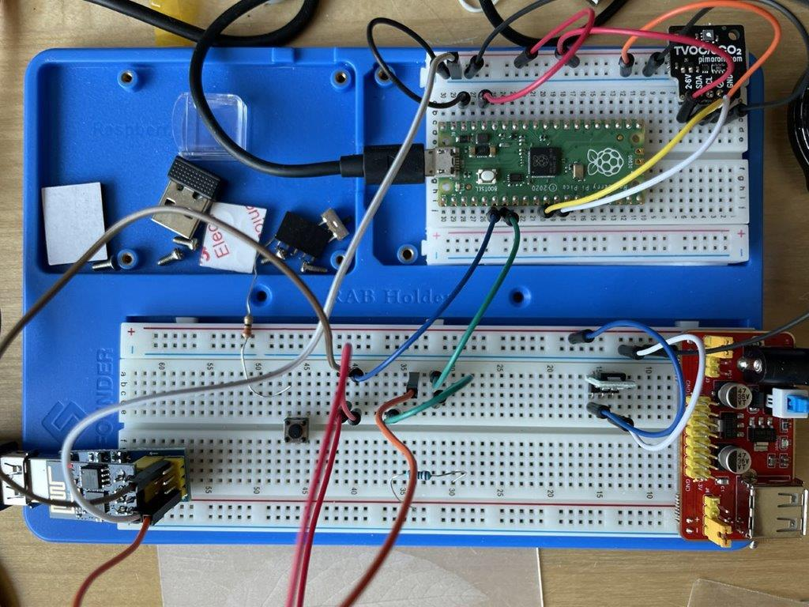

# Air quality sensor with Pico Esp01 SGP30

An air quality sensor. 
- Components: Raspberry Pico, ESP-01, SGP30 (from Adafruit)
- Language: Micropython
- Output: mqtt

## Description

This project was my first makers project. 
I ordered a Rapsberry Pico and thought about: what is a nice starters project beside the blinking leds.
My wife had already asked for a sensor for air quality, and that looked a nice and small starters project.

Components used:

**SGP30**: https://shop.pimoroni.com/products/sgp30-air-quality-sensor-breakout
- There are also break-out versions with micro-USB or pre-soldered pins. 

**RPi Pico**: https://www.raspberrypi.org/products/raspberry-pi-pico/
- I bought the cheapest but that missed pre-soldered pins, so for development I also bought one with this

**ESP01 1Mb**: https://www.tinytronics.nl/shop/nl/communicatie-en-signalen/draadloos/wi-fi/modules/esp8266-wifi-module-esp-01s-1mb
- I was (and still am) a noob when it comes to ESP's, but I am catching up
- 1 Mb is needed to load the Micropython image

## Getting Started

### Wiring

I will provide a schema when finished with testing :-)

### Dependencies

**Pico**: Micropython version out-of-the-box, I haven't used any special things. I2C and Serial only

**ESP-01**: I flashed it with esp8266-1m-20210618-v1.16.bin from [micropython.org](https://micropython.org/download/esp8266/)

**SGP30**: please note:
- I found a library which turned out a little bit old (the latest versions from Adafruit can be found on their site). 
- But because I am not used to all the dependencies of Adafruit and CircuitPython, I still uses that older version. 
- Mainly because it works pretty much on its own with no specific dependencies. and it needed a small change, see contents.
- I might switch to full-swing Adafruit in the future, though ;-)

It needs a MQTT server to post the output of the sensor. Topics are SGP30 voor measurements and SGP30_mgt for internal info.

### Installing

**ESP-01**: 
- Flash with Micropython
- Copy all the files to the root of the device
- Update the secrets.py to set your SSID and password and the mqtt server
- Boot

**Pico**:
- Copy all the files to the root of the device
- Boot

### Executing program

If correctly wired, the electronics should post messages on mqtt:
- Topic: SGP30, value: "t:<co2eq>:<tvov>" example: "t:400,5"  
- Topic: SGP30_mgt: value: "m:<mem>:<cycle>" example: "m:20560,13"

The SGP30_mgt was introduced to find a memory leak. After propoerly using the garbage collector, it works ok now.
Internally it measures the amount of memory used and if more than 20k bytes, it starts gc. 
The counter shows how many cycles before gc is started. 
To make it fail safe, it reboots is cycle counter is 1 (I've never seen this happen).
  
## Help

## Authors

Contributors names and contact info

Leen Blom
[@L1Blom](https://twitter.com/l1blom) 

## Version History

* 0.1
    * Initial Release

## License

[MIT](https://choosealicense.com/licenses/mit/)

## Acknowledgments

Inspiration, code snippets, etc.
* [must-read-for-noobs-like-me](https://randomnerdtutorials.com/micropython-mqtt-esp32-esp8266/)
* [adafruit-sgp30](https://learn.adafruit.com/adafruit-sgp30-gas-tvoc-eco2-mox-sensor/circuitpython-wiring-test)
